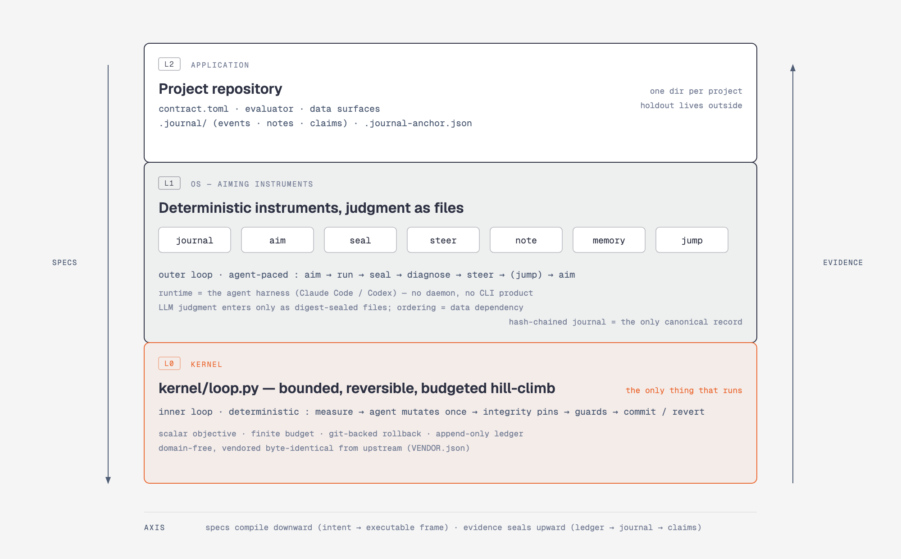

# Loop OS

A three-layer system for running bounded, evidence-first research with an LLM agent — without ever trusting the agent.

The **kernel** only climbs: it optimizes one scalar objective under guards, budgets, and git-backed rollback. The **OS** only decides where to climb: deterministic instruments compile your research intent into kernel specs and seal everything that happens into a tamper-evident journal. Your **application** is just a directory: a contract, an evaluator, and the journal. The LLM proposes directions and interprets results, but its judgment enters the system only as digest-sealed files — if the file isn't there, the system structurally stops.



## Why

Letting an agent hill-climb a research metric is, by construction, an overfitting machine: every accepted step burns statistical validity, and an unsupervised agent will happily improve the number by breaking the program. Loop OS contains both failure modes with structure instead of supervision:

- **The objective is a licensed proxy, not the truth.** Every objective must name the contract clause that licenses it (`proxy_license`), and the real verdict happens once, outside the system, on data the system physically cannot read.
- **Budgets are multiple-testing contracts.** Iterations are drawn at spec-issue time and never refunded — an abandoned run still burns its draw. The sealed denominator counts every evaluation, including ones the agent ran quietly inside an iteration.
- **Guards carry the proof.** The kernel doesn't judge correctness; your guard commands do. A change that improves the objective but breaks a guard is reverted. A change that touches a pinned file voids the iteration entirely.
- **Judgment is a file, not a state transition.** There is no workflow engine and no state machine. Ordering is enforced by data dependency: each step's input must cite the previous step's output digest, so skipping a step makes the next one impossible rather than forbidden.

## Install

Requirements: Python ≥ 3.11, git, [uv](https://docs.astral.sh/uv/), and an agent harness (Claude Code or Codex) to act as the outer-loop runtime.

```bash
git clone https://github.com/bbangjooo/loop-os.git ~/loop-os
cd ~/loop-os
uv sync
uv run pytest -q && uv run pytest kernel/tests/ -q   # 66 OS + 72 kernel tests
```

Optionally install the agent skill so your harness knows how to drive the instruments:

```bash
cp -r ~/loop-os/SKILL.md ~/.claude/skills/loop-os/SKILL.md   # Claude Code
cp -r ~/loop-os/SKILL.md ~/.agents/skills/loop-os/SKILL.md   # Codex
```

There is no CLI product and no daemon. The instruments in `os/` are plain scripts, always run by path from this repo (the directory has no `__init__.py`, so it never shadows Python's stdlib `os` module).

## Usage

Your project is any git repository. Loop OS adds three things to it: a **contract** (what to optimize, under which guards, with how much budget), a **journal** (`.journal/`, the only canonical record — hash-chained, gitignored, written only by instruments), and **specs** the kernel runs.

### 1. Bootstrap and register

```bash
cd ~/loop-os
uv run python os/journal.py bootstrap --project ~/my-project --project-id my-project
# author contract.toml in your project (see below), then:
uv run python os/seal.py contract --project ~/my-project --contract ~/my-project/contract.toml
```

A minimal contract:

```toml
schema = "ros2-contract-v1"
integrity = ["evaluator.py"]              # pinned during runs; touching these voids the iteration

[project]
id = "my-project"

[frame]
generation = 1
class = "my_hypothesis_class"
mechanism = "why you believe the objective can move, in one falsifiable paragraph"

[budget]
iterations_total = 12                     # the generation's multiple-testing contract

[agent]
command = ["claude", "-p", "{prompt}", "--model", "claude-opus-5", "--dangerously-skip-permissions"]
timeout_seconds = 1800

[[stages]]
id = "main"
iterations = 8
prompt = "What the agent should attempt, one conceptual change per iteration."

[stages.objective]
command = ["python3", "evaluate.py"]      # prints one number on the last line
direction = "minimize"
margin = 1
target = 0
proxy_license = "which contract clause licenses this number as a proxy for the real goal"

[[stages.guards]]
id = "tests"
command = ["pytest", "-q"]
kind = "exit_zero"
```

### 2. Run the cycle

```bash
uv run python os/journal.py status --project ~/my-project   # tells you the next required input
uv run python os/aim.py --project ~/my-project --contract ~/my-project/contract.toml
cd ~/my-project && git add -A && git commit -m "spec"        # kernel refuses untracked specs
cd ~/loop-os && uv run python kernel/loop.py --repo ~/my-project run loop/runs/<date>-<loop_id>/spec.yaml
uv run python os/seal.py run --project ~/my-project \
  --summary ~/my-project/loop/runs/<...>/summary.json \
  --ledger  ~/my-project/.git/experiment-loop/<loop_id>/ledger.jsonl
# author diagnosis.json (verdict + what moved + mechanism + counterfactual + next question), then:
uv run python os/seal.py diagnosis --project ~/my-project --file diagnosis.json
uv run python os/journal.py anchor --project ~/my-project    # commit .journal-anchor.json
```

`aim` is fail-closed. It refuses — with a code that names the missing input — when the journal is broken (`R1`), the contract drifted since registration (`R2`), a run is unsealed (`R3`), a diagnosis is missing (`R4`), or the generation budget can't cover the draw (`R5`). The refusal *is* the workflow: fix the named input and aim again.

### 3. Read, remember, and jump

```bash
uv run python os/steer.py frame-health --project ~/my-project   # evidence + 3 interpretation requests, no verdicts
uv run python os/note.py --project ~/my-project --kind anomaly --body note.json --refs <event-id>
uv run python os/memory.py extract --project ~/my-project       # distill sealed diagnoses into claims
```

When a hypothesis class dies (three REJECTED diagnoses) or a generation's budget is spent, you change frames with a **jump** — the only path from advisory notes to a new contract:

```bash
uv run python os/steer.py residual --project ~/my-project             # what the rejections share
# author a rival_draft note, then:
uv run python os/steer.py dossier --project ~/my-project --rival <note-id> > dossier.json
# author the successor contract (generation + 1), an independent review, and a human approval file, then:
uv run python os/jump.py adopt --project ~/my-project \
  --dossier dossier.json --successor contract.toml --review review.json --approval approval.json
uv run python os/seal.py contract --project ~/my-project --contract ~/my-project/contract.toml
```

Adoption is one atomic journal event citing the four files' digests — no receipts, no phases. Registering a higher generation without that event is refused. Until the successor draws budget, an adoption can be undone (`os/jump.py revoke`), which also voids the registration that cited it.

The full operating procedure the agent follows is [SKILL.md](SKILL.md).

## Architecture

The design document is [docs/design.md](docs/design.md); a rendered architecture diagram lives at [docs/architecture-diagram.html](docs/architecture-diagram.html) (exported: [SVG](docs/architecture.svg) · [PNG](docs/architecture.png)).

### Two nested loops

| | Inner loop (kernel) | Outer loop (OS) |
|---|---|---|
| Runs | seconds–minutes per iteration | one cycle per run |
| Driver | `kernel/loop.py`, fully deterministic | the agent harness, following SKILL.md |
| One step | measure → agent mutates once → check pins → run guards → re-measure → commit or `git reset --hard` | aim → run → seal → diagnose → steer → (jump) → aim |
| Failure | rejected (reverted) or void (pins moved) | a refusal naming the missing input |

### Layers

- **Kernel — `kernel/loop.py`.** A single-file, stdlib+PyYAML, domain-free experiment loop, vendored byte-identical from its upstream (`infocz/gos`) and pinned by `kernel/VENDOR.json`. It owns exactly four things: a scalar objective, reversibility, a short horizon, and a finite budget. It is the only thing that executes.
- **OS — `os/`.** Seven single-file instruments, each a pure function (files in → files out + at most one journal append): `journal` (hash-chained canonical record, verify/status/anchor), `aim` (contract + journal → kernel spec, fail-closed R1–R5), `seal` (contract/run/diagnosis/abandon), `steer` (read-only projections: status, frame-health, residual, jump dossier), `note` (screened advisory notes with prior binding), `memory` (claims + exact-class retrieval), `jump` (atomic adoption, revoke).
- **Application — your repo.** A contract, an evaluator, data surfaces, and the journal. Two applications exist as references: the toy project in `tests/` (runs in CI) and a live quantitative-research deployment.

### Integrity model

- The journal is append-only and hash-chained; every event cites its input files by SHA-256. Instruments are the only writers.
- The chain's one blind spot (a canonical edit to the newest line) is closed by **anchoring**: the verified head digest is written to a git-tracked file and committed, so rewriting sealed history breaks against git history.
- Anti-gaming is digests, budgets, and reverts — never permissions or trust. The contract itself is integrity-pinned during runs, so the frame cannot drift mid-climb.
- Deployment, releases, capital allocation, and live trading have no vocabulary here: there is no field in any schema that could authorize them.

## License

MIT
