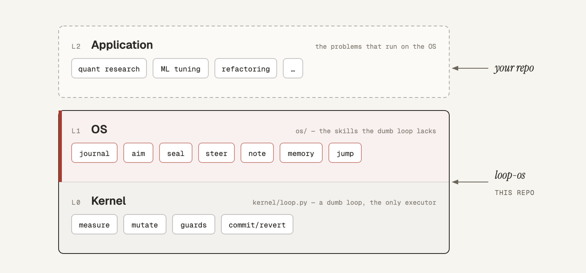
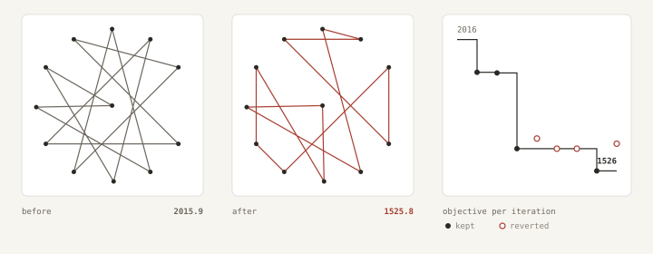

# Loop OS — Make your dumb loop SMART

A three-layer system that takes a dumb hill-climbing loop and makes it smart:

- **Kernel** (`kernel/loop.py`) — a *dumb loop*. Measure, mutate once, run guards, commit or revert — one scalar objective, nothing else. The only thing that executes.
- **OS** (`os/`) — the *skills the dumb loop lacks*. Seven deterministic instruments for aiming, sealing evidence, steering, memory, and jumping between hypothesis frames.
- **Application** (your repo) — the *problems that run on the OS*: quant research, ML tuning, refactoring — anything with a contract, an evaluator, and the journal.

The LLM proposes directions and interprets results, but its judgment enters the system only as digest-sealed files — if the file isn't there, the system structurally stops.



## Why

- **A dumb loop climbs one number — it can't ask whether the number is worth climbing.** The OS makes every objective cite the contract clause that licenses it as a proxy (`proxy_license`); the real verdict happens outside, on data the system can't read.
- **A dumb loop spends iterations — it can't police how many.** The OS turns budgets into multiple-testing contracts: iterations are drawn up front and never refunded, and abandoned runs still count.
- **A dumb loop reverts bad changes — it can't remember what happened.** The OS seals every run, diagnosis, and contract into a hash-chained journal, anchored in git so history can't be quietly rewritten.
- **A dumb loop can't change its own frame.** The OS owns jumps: a dead hypothesis class is replaced only through a reviewed, human-approved, sealed adoption.
- **Any loop, any problem.** The kernel and OS know nothing about the domain — any repo with a contract and an evaluator runs unchanged, whether the problem is quant research, ML tuning, or refactoring.

## Getting Started

### Install

```bash
curl -fsSL https://raw.githubusercontent.com/bbangjooo/loop-os/main/install.sh | sh
```

This clones the repo into `~/loop-os`, installs dependencies with [uv](https://docs.astral.sh/uv/), installs the agent skill and slash commands into every harness it finds, and runs the test gate. Requirements: Python ≥ 3.11, git, uv, and an agent harness as the outer-loop runtime.

The examples below are Claude Code. Codex gets the same commands under flat names — `/loop-os-run-example`, `/loop-os-bootstrap`, `/loop-os-contract`, `/loop-os-cycle`, `/loop-os-status`.

The installer adds five slash commands to Claude Code. Run them from inside the project you want to work on.

### 1. See it work

```
/loop-os:run-example
```

One complete cycle on a throwaway project — nothing of yours is touched, no API key needed. The problem is a real one: twelve delivery stops and a route that crosses itself. A scripted stand-in plays the agent, reversing one randomly chosen segment per iteration with no idea whether that helps. Every step calls the real instruments:

```
== aim — compile the contract into a kernel spec
{ "status": "SPEC_ISSUED", "loop_id": "delivery-round-g1-001", "draw": 8, "budget_remaining": 8,
  "note": "commit the spec before running; the kernel refuses an untracked in-worktree spec" }

== run the kernel — the only step that executes anything
  1 accepted  2015.947 -> 1893.706      5 rejected  1608.642 -> 1608.642
  2 accepted  1893.706 -> 1891.481      6 rejected  1608.642 -> 1608.642
  3 accepted  1891.481 -> 1608.642      7 accepted  1608.642 -> 1525.805
  4 rejected  1608.642 -> 1646.536      8 rejected  1525.805 -> 1627.264

== seal the run
{ "status": "RUN_SEALED", "trials_denominator": 8,
  "next_required": "author a diagnosis file and seal it (os/seal.py diagnosis)" }

== status — where the project now stands
{ "status": "OK", "generation": 1, "runs_sealed": 1, "drawn_by_generation": { "1": 8 },
  "next_required": "issue the next spec (os/aim.py)" }
```

The round got 24% shorter, but four of the eight proposals made it worse and were reverted by `git reset --hard` — the loop is real, not a scripted descent. The sealed denominator is 8, not 4, because the budget counts what you tried; and the generation has 8 of its 16 iterations left, drawn up front and gone whether or not the run had worked.



### 2. Bootstrap your own project

```
/loop-os:bootstrap
```

- Your project is any git repository. Loop OS adds a **contract** (what to optimize, under which guards, with how much budget) and a **journal** (`.journal/` — hash-chained, gitignored, written only by instruments).
- Offers a per-frame git worktree when you'll run more than one frame — the kernel commits and reverts in the working tree, so frames sharing a checkout collide.
- Creates the journal, then hands off to the contract builder below.

### 3. Describe the problem, get a contract

```
/loop-os:contract   the test suite takes 40 minutes; I want it under 10 without losing coverage
```

The contract is where Loop OS projects are won or lost, so it has its own builder:

- Turns a plain-language problem statement into the four contract questions — objective, falsifiable mechanism, guards, budget — inferring what it can from the repo and asking the rest in one batch.
- Writes the evaluator if no command prints the number yet.
- Has the draft independently reviewed against a defect checklist (proxy honesty, gameable guards, unpinned surfaces, indefensible budget) and refuses to seal over unresolved defects. The contract is the one artifact nothing else in the system re-checks, so the review happens before the seal, not after.

A minimal contract:

```toml
schema = "ros2-contract-v1"
integrity = ["evaluator.py"]              # pinned during runs; touching these voids the iteration

[project]
id = "my-project"

[frame]
generation = 1
class = "my_hypothesis_class"
mechanism = "why you believe the objective can move, in one falsifiable paragraph"

[budget]
iterations_total = 12                     # the generation's multiple-testing contract

[agent]
command = ["claude", "-p", "{prompt}", "--model", "claude-opus-5", "--dangerously-skip-permissions"]
timeout_seconds = 1800

[[stages]]
id = "main"
iterations = 8
prompt = "What the agent should attempt, one conceptual change per iteration."

[stages.objective]
command = ["python3", "evaluate.py"]      # prints one number on the last line
direction = "minimize"
margin = 1
target = 0
proxy_license = "which contract clause licenses this number as a proxy for the real goal"

[[stages.guards]]
id = "tests"
command = ["pytest", "-q"]
kind = "exit_zero"
```

### 4. Run cycles

```
/loop-os:cycle       # one full cycle: aim → run → seal → diagnose → steer → anchor
/loop-os:status      # read-only: chain health, budget, next required action
```

`aim` is fail-closed. It refuses — with a code that names the missing input — when the journal is broken (`R1`), the contract drifted since registration (`R2`), a run is unsealed (`R3`), a diagnosis is missing (`R4`), or the generation budget can't cover the draw (`R5`). The refusal *is* the workflow: fix the named input and aim again, which is exactly what the cycle command does.

### 5. Jump when the frame dies

When a hypothesis class dies (three REJECTED diagnoses) or a generation's budget is spent, you change frames with a **jump** — the only path from advisory notes to a new contract. Adoption is one atomic journal event citing four files: the dossier of what the rejections share, the successor contract (generation + 1), an independent review, and a human approval. Registering a higher generation without that event is refused, and until the successor draws budget the adoption can be revoked.

A jump is a human decision, so it stays a deliberate sequence of instrument calls rather than a one-word command — the full operating procedure, including every raw instrument invocation, is [SKILL.md](SKILL.md). The design document is [docs/design.md](docs/design.md).

## Benchmark

The system's claims are measured, not assumed — see [bench/README.md](bench/README.md). The deterministic gate (red-team containment, capability floor, denominator honesty, crash resume) runs in CI on every push and PR to main. The measurement runner produces a scoreboard on synthetic problems with known ground truth, locally, with the scripted baseline or a real LLM agent:

```bash
uv run python bench/run.py --agent scripted
uv run python bench/run.py --agent claude --model claude-opus-5
```

What the benchmark cannot prove — real research efficacy on non-synthetic domains — is documented there honestly.

## License

MIT
