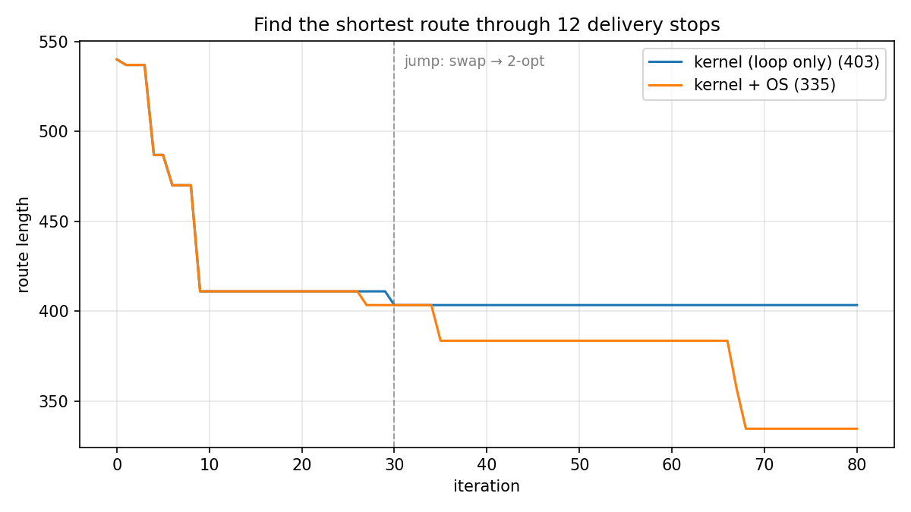

# Loop OS — Make your dumb loop SMART

A three-layer system that takes a dumb hill-climbing loop and makes it smart:

- **Kernel** (`kernel/loop.py`) — a *dumb loop*. Measure, mutate once, run guards, commit or revert — one scalar objective, nothing else. The only thing that executes.
- **OS** (`os/`) — the *skills the dumb loop lacks*. Seven deterministic instruments for aiming, sealing evidence, steering, memory, and jumping between hypothesis frames.
- **Application** (your repo) — the *problems that run on the OS*: quant research, ML tuning, refactoring — anything with a contract, an evaluator, and the journal.

The LLM proposes directions and interprets results, but its judgment enters the system only as digest-sealed files — if the file isn't there, the system structurally stops.


## Why

- **A dumb loop climbs one number — it can't ask whether the number is worth climbing.** The OS makes every objective cite the contract clause that licenses it as a proxy (`proxy_license`); the real verdict happens outside, on data the system can't read.
- **A dumb loop spends iterations — it can't police how many.** The OS turns budgets into multiple-testing contracts: iterations are drawn up front and never refunded, and abandoned runs still count.
- **A dumb loop reverts bad changes — it can't remember what happened.** The OS seals every run, diagnosis, and contract into a hash-chained journal, anchored in git so history can't be quietly rewritten.
- **A dumb loop can't change its own frame.** The OS owns jumps: a dead hypothesis class is replaced only through a reviewed, human-approved, sealed adoption.
- **Any loop, any problem.** The kernel and OS know nothing about the domain — any repo with a contract and an evaluator runs unchanged, whether the problem is quant research, ML tuning, or refactoring.

## Getting Started

### Install

```bash
curl -fsSL https://raw.githubusercontent.com/bbangjooo/loop-os/main/install.sh | sh
```

This clones the repo into `~/loop-os`, installs dependencies with [uv](https://docs.astral.sh/uv/), installs the agent skill and slash commands into every harness it finds, and runs the test gate. Requirements: Python ≥ 3.11, git, uv, and an agent harness as the outer-loop runtime.

The examples below are Claude Code. Codex gets the same commands under flat names — `/loop-os-run-example`, `/loop-os-bootstrap`, `/loop-os-contract`, `/loop-os-cycle`, `/loop-os-status`.

The installer adds five slash commands to Claude Code. Run them from inside the project you want to work on.

### 1. See it work

```
/loop-os:run-example
```

Runs the same kernel twice on the same 12-stop routing problem — once bare, once governed by the OS — in throwaway directories, no API key. Every step calls the real instruments:



- Same kernel, same objective (route length), same seeded proposals — the only difference is the OS around the loop.
- **Loop only** stalls at 403: its adjacent-swap frame is exhausted, and the kernel has no way to know — 75 of its 80 iterations are spent proposing into a dead frame.
- **With the OS**, three sealed runs (accepts 4 → 0 → 1) spend the generation's budget; the aim refusal, residual, dossier, independent review, and human approval license a **jump** to a 2-opt frame — and the same objective falls to 335.
- The kernel finds the best answer inside one frame. The OS decides which frame deserves the budget.

### 2. Bootstrap your own project

```
/loop-os:bootstrap   the test suite takes 40 minutes; I want it under 10 without losing coverage
```

- Your project is any git repository. Loop OS adds a **contract** (what to optimize, under which guards, with how much budget) and a **journal** (`.journal/` — hash-chained, gitignored, written only by instruments).
- Offers a per-frame git worktree when you'll run more than one frame — the kernel commits and reverts in the working tree, so frames sharing a checkout collide.
- Creates the journal, then feeds your problem statement to the **contract builder** (`/loop-os:contract`, also standalone): it turns the statement into the four contract questions — objective, falsifiable mechanism, guards, budget — writes the evaluator if no command prints the number yet, and has the draft independently reviewed against a defect checklist before sealing. The contract is the one artifact nothing else in the system re-checks, so the review happens before the seal, not after.
- What comes out looks like the example's [contract.toml](examples/delivery-round/seed/contract.toml).

### 3. Run cycles

```
/loop-os:cycle       # one full cycle: aim → run → seal → diagnose → steer → anchor
/loop-os:status      # read-only: chain health, budget, next required action
```

`aim` is fail-closed. It refuses — with a code that names the missing input — when the journal is broken (`R1`), the contract drifted since registration (`R2`), a run is unsealed (`R3`), a diagnosis is missing (`R4`), or the generation budget can't cover the draw (`R5`). The refusal *is* the workflow: fix the named input and aim again, which is exactly what the cycle command does.

### 4. Jump when the frame dies

A dead hypothesis class (three REJECTED diagnoses, or a spent budget) is replaced only through a **jump**: one atomic journal event citing the dossier, the successor contract, an independent review, and a human approval — exactly what the example above did at iteration 30. A jump is a human decision, so it stays a deliberate sequence of instrument calls rather than a one-word command; the full operating procedure is [SKILL.md](SKILL.md), and the design document is [docs/design.md](docs/design.md).

## License

MIT
